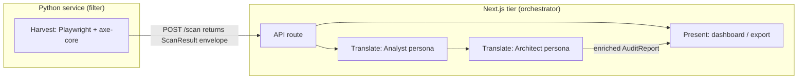
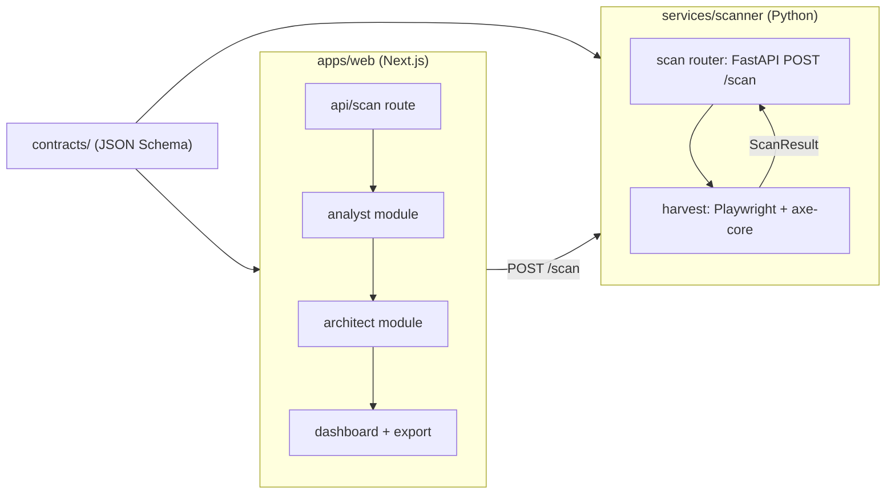

# Architecture Spine — Darkhouse

## Design Paradigm

Pipes-and-filters over an immutable Audit Report envelope. The pipeline has three stages — **Harvest** (Python scan service), **Translate** (Analyst + Architect personas), **Present** (dashboard) — and the only thing passed between them is the versioned `AuditReport` JSON envelope defined once in shared contracts. One orchestrator (the Next.js tier) drives the stages; the Python service is a pure filter that knows nothing about AI, storage, or UI.



## Inherited Invariants

*(None — initiative-level greenfield spine.)*

## Invariants & Rules

### AD-1 — Pipeline paradigm and single orchestrator

- **Binds:** all pipeline stages (FR-1–FR-7, FR-11, FR-12)
- **Prevents:** two-tier drift — a Python service that grows into a second UI or a Next.js tier that bypasses the pipeline and invents its own scan path
- **Rule:** All scanning flows through the three-stage harvest→translate→present pipeline. The Next.js tier is the only orchestrator; it calls the Python service, runs the personas, and serves the dashboard. The Python service never initiates work, never calls AI, and never renders UI.

### AD-2 — Harness is a stateless HTTP filter

- **Binds:** services/scanner (FR-1, FR-2, FR-3)
- **Prevents:** the scan service becoming a stateful monolith that owns reports or queues
- **Rule:** `services/scanner` exposes a minimal HTTP API (`POST /scan` → `ScanResult`). It holds no business state, stores nothing, and returns a single typed envelope per request. Request → result, synchronous; cancellation via standard HTTP.

### AD-3 — The AuditReport envelope is the single contract

- **Binds:** all stages and both buildings (web + scanner)
- **Prevents:** schema divergence — the worst failure mode for a two-language pipeline (Python `dict`s vs TS types drifting until a field is unknowable)
- **Rule:** Exactly one canonical `AuditReport` JSON Schema lives in `contracts/`. Both the Python scanner's parsed output and the TS/React types are generated/validated from it. Every stage validates against it on write. `ScanResult` (raw: violations + vitals) and `AuditReport` (enriched: + analyst impacts + architect patches) are two schema versions of the same envelope; a `schemaVersion` field is mandatory. No other interchange format crosses the tier boundary.

### AD-4 — Reports are immutable

- **Binds:** storage at the web tier, dashboard (FR-8), export (FR-11, FR-12)
- **Prevents:** a re-scan silently mutating a report that a client or developer already read (breaking the audit trail and the lead-gen artifact)
- **Rule:** Once persisted, an AuditReport is immutable. Re-running a scan produces a new `scanId` and a new report. No in-place mutation of an existing report; corrections produce a new revision.

### AD-5 — Personas are separate modules; patches are proposed, never applied

- **Binds:** translate stage (FR-4, FR-5, FR-6, FR-7)
- **Prevents:** architect output being trusted as applied truth; an "auto-fix" capability creeping into the product
- **Rule:** The Analyst and Architect personas are independent modules consuming the same AuditReport. The Architect emits Patch blocks carrying `status: proposed` plus the WCAG rule and affected nodes. No code path — in either language — applies a Patch to any repository. The dashboard renders artifacts as proposed (FR-7).

### AD-6 — Monorepo boundary and dependency direction

- **Binds:** repository structure, all future code
- **Prevents:** web importing scanner internals or scanner importing web/TS code (a coupling that kills the entire dual-tier premise)
- **Rule:** The repository is a pnpm workspace monorepo: `apps/web` (Next.js tier), `services/scanner` (Python), `contracts/` (shared schemas), root-level `Dockerfile`/orchestration (v1: local-first). Dependency direction is `web→contracts`, `scanner→contracts`. Web and scanner communicate only over HTTP and never import each other's source.

### AD-7 — AI personas are provider-agnostic

- **Binds:** translate stage (FR-4, FR-6)
- **Prevents:** lock-in to one model or paid vendor, and an OSS repo that can't run free
- **Rule:** Personas talk to an OpenAI-compatible chat interface configured per-request (provider, model, max-tokens). Provider/model live in configuration, not code. The sample/default config stays on free-tier providers (OQ-1).

## Consistency Conventions

| Concern | Convention |
| --- | --- |
| Naming (entities, files, interfaces, events) | Pipeline stages: `harvest/`, `translate/`, `present/`. Persona modules: `analyst/`, `architect/`. Filenames lowercase-kebab `[ASSUMPTION: repo style]`. |
| Data & formats (ids, dates, error shapes, envelopes) | `scanId` = ULID. Dates ISO-8601 UTC. Error envelope: `{ code, message, stage }`. Violation/impact/patch carry `nodeId`s from the ScanResult. Severity vocabulary fixed from UX: critical / moderate / minor. |
| State & cross-cutting (mutation, errors, logging, config) | Pipeline stage timestamps logged (FR observability NFR). AI config env-driven (`A11Y_AI_PROVIDER`, `A11Y_AI_MODEL`, `A11Y_AI_KEY`). No secrets in repo. |

## Stack

| Name | Version |
| --- | --- |
| Next.js (App Router) | 16.3.0 (in repo) |
| React | 19.2.8 (in repo) |
| Tailwind CSS | v4 (in repo) |
| Python | 3.12+ |
| FastAPI (harness) | 0.141.x (web-verified 2026-07) |
| Playwright (Python driver) | ~1.60 (web-verified 2026) |
| axe-core | 4.11.4 (web-verified 2026-07) |
| pnpm workspace | 11.19 (in repo) |
| Structured scan payload | `@axe-core/playwright` 4.12.1 shape or direct axe injection (harness detail) |

## Structural Seed



```text
{root}/
  apps/web/                 # Next.js tier: dashboard, API routes, personas, export
    app/                    # App Router: pages + routes
    lib/translate/          # analyst.ts, architect.ts (provider-agnostic)
  services/scanner/         # Python FastAPI harvest service
    app/main.py             # POST /scan
    app/harvest.py          # Playwright + axe-core
  contracts/                # Single source of truth
    audit-report.schema.json
    scan-result.schema.json
  Dockerfile                # local-first compose (v1)
  pnpm-workspace.yaml
```

## Capability → Architecture Map

| Capability / Area | Lives in | Governed by |
| --- | --- | --- |
| Scan public URL, SPA wait, vitals (FR-1, FR-2, FR-3) | services/scanner | AD-2, AD-3 |
| Analyst impacts + ranking (FR-4, FR-5) | apps/web/lib/translate/analyst | AD-5, AD-7 |
| Architect patches, proposed-only (FR-6, FR-7) | apps/web/lib/translate/architect | AD-5, AD-7 |
| Dual-view dashboard toggle (FR-8, FR-9, FR-10) | apps/web Present | AD-1, AD-4 |
| Export + broken-proof (FR-11, FR-12) | apps/web Present/export | AD-1, AD-4 |

## Deferred

- **Multi-scan queue / prioritization** — v1 is local, synchronous, bounded. Queue becomes an AD when a hosted tier arrives.
- **Storage engine** — v1 can persist to local files/JSON at the web tier; a database + migration story is a post-MVP decision. Immutability (AD-4) already constrains whichever lands.
- **Auth / multi-tenant / SaaS** — explicitly out of scope (PRD §2.2); touched only by hosted-tier vision.
- **CI/CD integrations** — post-MVP; the pipeline and envelope shape future-proof the seam (a CI consumer reads the same AuditReport).
- **Provider lock** — OQ-1 resolved at config level, not architecture: personas already assume pluggability (AD-7).